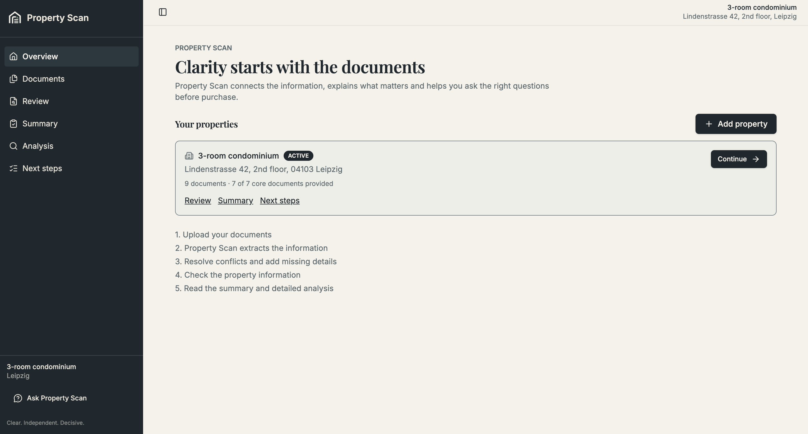
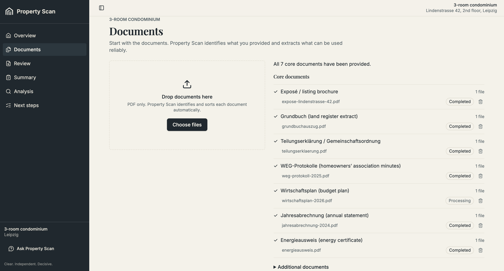
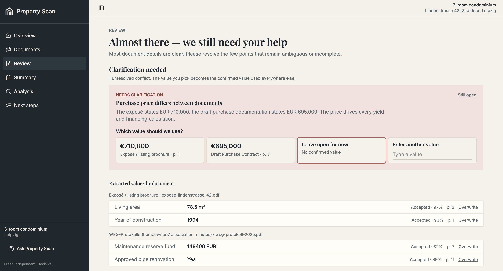
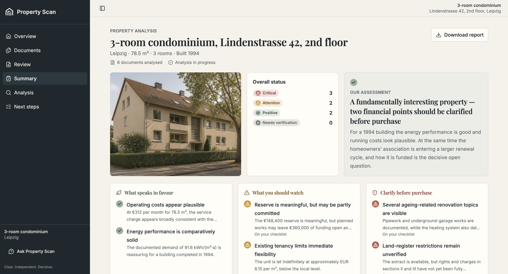
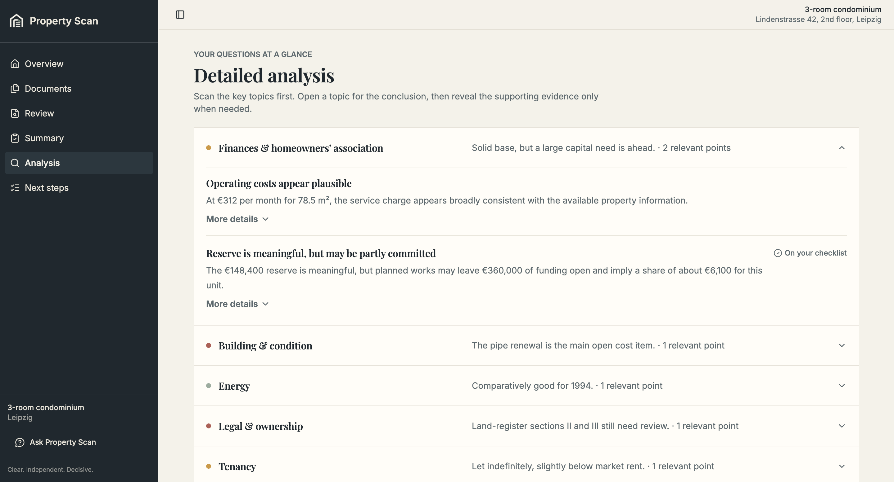
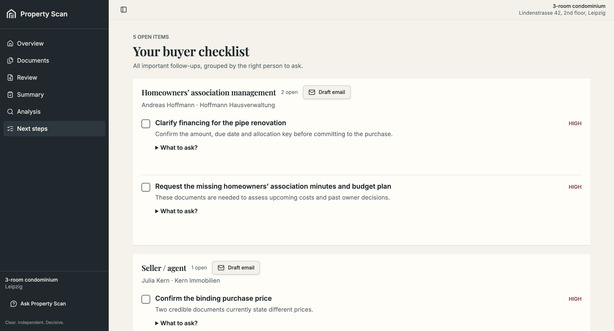
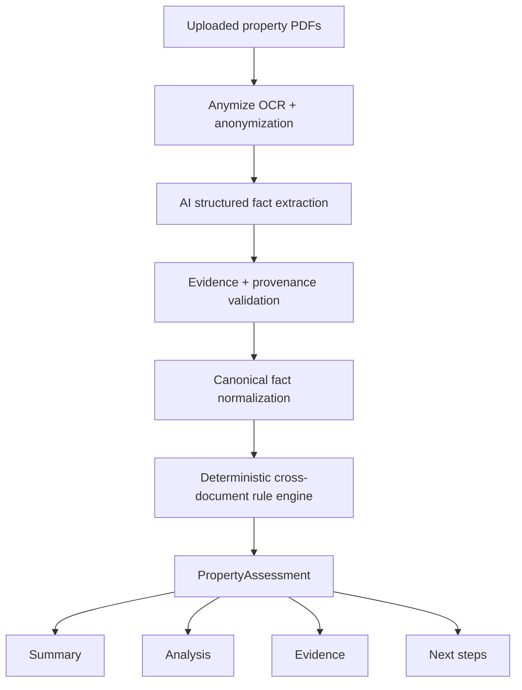
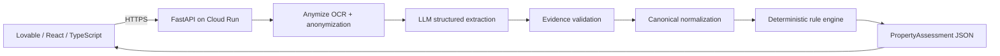
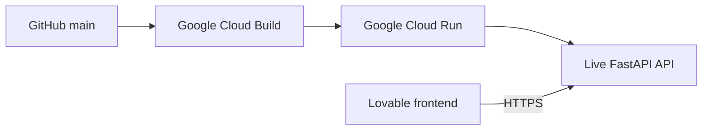

<div align="center">


### A clearer view of what matters.

**More than documents. Real answers.**

AI-supported property due diligence for residential buyers - built during the **AI.WOMEN Hackathon 2026**.

**Trust · Evidence · Clarity**

[Live App](https://propertyscan.lovable.app/) · [API](https://property-due-diligence-api-267668658542.europe-west1.run.app) · [API Docs](https://property-due-diligence-api-267668658542.europe-west1.run.app/docs)

</div>

---

## Why Property Scan?

Buying a home should feel exciting. Instead, buyers often receive a pile of documents written for professionals - and are expected to know what matters.

A floor plan. A land-register extract. Homeowners' association minutes. Financial statements. Energy documents. Planned maintenance.

The difficult part is not finding the information. **It is connecting it.**

Property Scan helps answer questions such as:

- Does the apartment size match across documents?
- Are expensive works mentioned somewhere else in the file set?
- Is a building-level project cost being mistaken for the buyer's own liability?
- Is important evidence missing?
- What should the buyer clarify before signing?

> **AI extracts the facts. Our rule engine cross-examines them across documents.**

---

## Product Walkthrough

### 1. Add a property

Start with only the basic property identity. Everything else should come from the documents.



### 2. Upload the document package

Upload multiple PDFs such as the Exposé, land-register extract, homeowners' association minutes, economic plan, annual statement, floor plan and energy certificate.

Property Scan treats them as **one property package**, not as isolated files.



### 3. See what matters first

The Summary gives the buyer a fast view of confirmed issues, unresolved questions and evidence-backed findings.



### 4. Investigate a finding

Findings are grouped into buyer-relevant themes and can be opened for deeper analysis.



### 5. Trace a finding back to evidence

Important findings stay connected to their underlying document and source passage.



### 6. Turn findings into action

Property Scan translates unresolved findings into concrete questions and next steps before signing.



---

## How It Works



The live MVP follows a request-processing architecture. Uploaded PDFs and extracted facts are processed through the analysis pipeline, but **no separate persistent document or structured-facts database is part of the current MVP**.

---

## What AI Does — and What It Does Not Do

AI is used for the parts that require understanding unstructured documents:

- document classification
- German-language property-document understanding
- structured fact extraction
- source-evidence extraction from anonymised text

AI does **not** make the final due-diligence decision on its own.

After extraction, Property Scan validates evidence, normalises facts into a canonical model and applies deterministic rules across documents. This separation makes the system easier to test, explain and improve.

---

## Evidence-First Analysis

A material finding can be traced through the system:

```text
PropertyAssessment
        ↓
Finding
        ↓
RuleEvaluation
        ↓
Triggering PropertyFact
        ↓
Source document / page / evidence
```

The backend deliberately preserves distinctions such as:

- living area ≠ tax area
- project total ≠ unit liability
- planned expenditure ≠ historical actual expenditure
- missing evidence ≠ non-compliance
- works completed ≠ contribution paid

Unknown information stays unknown rather than being guessed.

---

## Example Findings

### Floor-area discrepancy

If two comparable documents contain different floor-area values, Property Scan keeps both sources visible and surfaces the inconsistency rather than silently choosing one.

**Buyer action:** Ask which floor-area figure is legally recognised and request supporting documentation.

### Planned works / financial exposure

Property Scan can identify planned or commissioned works across homeowners' association minutes and economic plans while distinguishing **whole-building project costs** from a confirmed **unit-specific buyer obligation**.

If buyer liability is not supported by the supplied evidence, the system reports **Needs verification** rather than presenting the building cost as the buyer's personal cost.

**Buyer action:** Request the unit-specific allocation, outstanding balance, payment schedule and confirmation of who is responsible for payment.

### Missing planning or legal evidence

When an alteration or extension is referenced without sufficient supporting planning evidence, Property Scan surfaces the missing evidence without claiming non-compliance that cannot be proven.

**Buyer action:** Request the relevant planning or compliance documents before proceeding.

---

## Product Experience

| Screen | Purpose |
| --- | --- |
| **Documents** | Upload and classify the property document package |
| **Review** | Confirm what was provided and what is still missing |
| **Summary** | Understand the most important findings quickly |
| **Analysis** | Explore findings by topic and severity |
| **Evidence** | Trace findings back to the underlying source passages |
| **Next steps** | Turn unresolved findings into concrete buyer actions |

---

## Technical Architecture



### Tools & Stack

| Layer | Technology |
| --- | --- |
| Buyer-facing frontend | **Lovable, React, TypeScript** |
| Backend API | **Python, FastAPI, Pydantic** |
| OCR + privacy | **Anymize AI** |
| Structured extraction | **LLM access routed through Anymize in the live MVP** |
| Cloud hosting | **Google Cloud Run** |
| CI/CD | **GitHub → Google Cloud Build → Cloud Run** |
| Secrets | **Google Cloud Secret Manager** |
| Model-provider exploration | **Google Cloud / Vertex AI integration explored during development** |
| Development support | **OpenAI Codex** |
| Version control | **GitHub** |

---

## Privacy & Security

Property documents can contain sensitive personal information, so privacy is part of the architecture rather than an afterthought.

The MVP is designed so that:

- documents are anonymised before downstream AI extraction
- API secrets are stored in Google Cloud Secret Manager
- real API keys are not committed to GitHub
- downstream rule evaluation works on anonymised structured facts
- provider errors are sanitised before being returned to users
- missing information is not silently inferred
- uploaded documents are **not persisted in a separate document database** in the hackathon MVP

---

## Resilient Multi-Document Processing

Property Scan processes documents independently so that one difficult file does not destroy the whole property assessment.

If one document cannot be processed safely:

1. the document is retried once
2. if it still fails, it is marked **Needs review**
3. successfully validated documents remain available
4. rules run only on successfully validated canonical facts
5. the assessment is explicitly marked incomplete
6. purchase readiness remains `NOT_DECISION_READY`

This is intentional: partial, transparent evidence is safer than silently fabricating missing facts or discarding a successful analysis of the remaining documents.

---

## Deterministic Rule Engine

The due-diligence engine is driven by a structured Rulebook developed by the team.

```text
Inputs
  ↓
Calculation
  ↓
Threshold / policy
  ↓
Rule result
  ↓
Finding
  ↓
Evidence
  ↓
Buyer action
```

The engine distinguishes between states such as:

```text
NOT_APPLICABLE
MISSING_INPUTS
EVALUATED_PASS
TRIGGERED
```

That distinction matters because:

> **“We do not have enough information” is not the same as “we checked this and everything is fine.”**

---

## Current MVP

The live hackathon MVP includes:

- multi-PDF upload
- PDF validation
- OCR + anonymization
- structured property-fact extraction
- evidence / provenance validation
- canonical fact normalization
- deterministic cross-document rule evaluation
- missing-information / needs-verification findings
- financial-context handling
- buyer actions
- evidence drill-down contract
- partial-document failure isolation
- production CORS configuration
- live Google Cloud deployment
- Lovable frontend integration

**195/195 automated backend tests passed on the latest verified release candidate.**

---

## API

### Health

```http
GET /health
```

### Demo assessment

```http
GET /demo-assessment
```

### Single-document analysis

```http
POST /analyze
```

### Multi-document property analysis

```http
POST /properties/analyze
```

The main endpoint accepts multiple PDFs using `multipart/form-data`. Every uploaded PDF uses the repeated field name `files`.

The backend returns one structured `PropertyAssessment` for the whole property package.

---

## Deployment



---

## Brand System

**Trust · Evidence · Clarity**

| Role | Color |
| --- | --- |
| Ink — Primary | `#17242B` |
| Ivory — Background | `#F5F2EA` |
| Sage — Success | `#9BAE9F` |
| Ochre — Attention | `#D39A3A` |
| Brick — Critical | `#B85C52` |
| Slate — Neutral | `#718087` |

**Typography**

- **Playfair Display** — headlines and emphasis
- **Inter** — body copy and UI text

---

## Team

| Team member | Focus |
| --- | --- |
| **Alina** | Frontend + Team Lead |
| **Julia** | Rulebook + Testing |
| **Virginia** | UX + Customer Journey |
| **Natascha** | Pitch + Storytelling / Brand |
| **Lea** | Backend + AI |

---

## What Makes Property Scan Different

Property Scan is not simply:

> Upload PDFs and receive summaries.

It is designed around:

```text
Documents
    ↓
Evidence-backed facts
    ↓
Cross-document comparison
    ↓
Conflicts / risks / unknowns
    ↓
Financial implications
    ↓
Buyer actions
```

The system is deliberately explicit about uncertainty.

If evidence is missing, it says evidence is missing. If two documents disagree, it keeps both values visible. If a cost is possible rather than confirmed, it remains possible. If payer responsibility is unknown, the system does not silently assign it to the buyer.

---

## Disclaimer

Property Scan is a hackathon prototype and decision-support tool. It does not provide legal, financial, tax, surveying or other professional real-estate advice.

Findings depend on the documents supplied, extraction quality, available evidence, normalisation logic and implemented rule definitions. Important conclusions should be independently verified before making a property-purchase decision.

---

<div align="center">

### AI.WOMEN Hackathon 2026

**Property Scan — A clearer view of what matters.**

</div>
